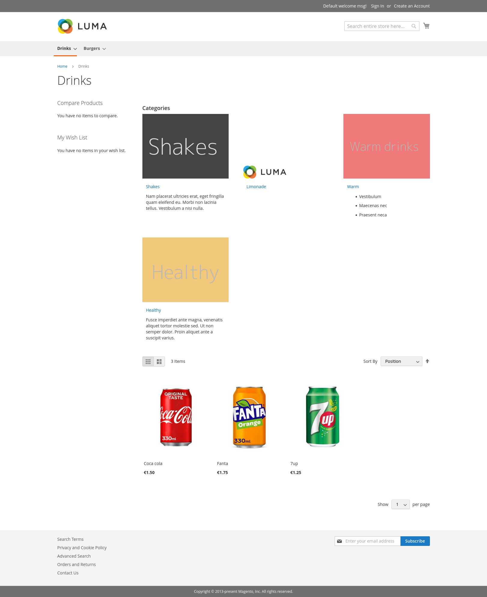
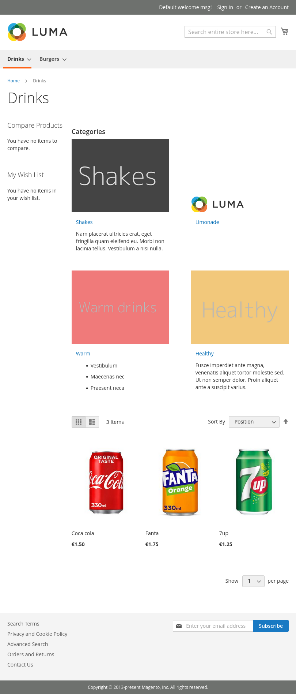
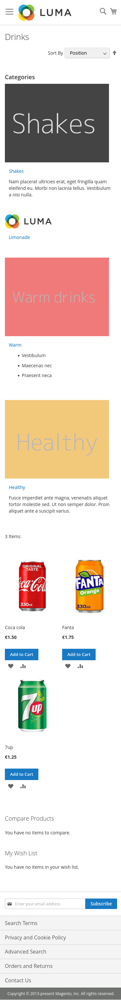

Bluebirdday Subcategories
=========================

Per Category toggleable of Listening of Subcategories.<br>
Image and text can be placed with the subcategory usp and subcategory image.


Installation
------------

```
composer require bluebirdday/subcategories
bin/magento module:enable Bluebirdday_Subcategories
bin/magento setup:upgrade
```

Module settings
---------------

| name    | type        | description              |
|---------|-------------|--------------------------|
| Enabled | yes/no      | Toggle module activation |

Category settings
-----------------

| name                         | type        | description                                                    |
|------------------------------|-------------|----------------------------------------------------------------|
| Enable list of subcategories | yes/no      | Lists subcategories                                            |
| Subcategory thumbnail        | image       | Upload thumbnail for subcategories (not automatically resized) |
| Subcategory USP list         | pagebuilder | Subcategory text                                               |


Preview
-------

### Desktop


### Tablet


### Mobile

